# Butano

Butano is a modern C++ high level engine for the [Game Boy Advance](https://en.wikipedia.org/wiki/Game_Boy_Advance).

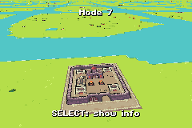  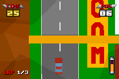

## Features

* Create and display sprites, backgrounds, text, raster effects and more with only one line of C++ code.
* Custom standard library without heap allocations nor exceptions, based on [ETL](https://www.etlcpp.com/).
* Import and use your own assets [with ease](https://gvaliente.github.io/butano/import.html).
* Multiple development tools like [asserts](https://gvaliente.github.io/butano/group__assert.html), 
[emulator logging](https://gvaliente.github.io/butano/group__log.html) and 
[code profiling](https://gvaliente.github.io/butano/group__profiler.html).
* Based on modern C++ concepts like shared ownership and RAII.
* Detailed [documentation](https://gvaliente.github.io/butano).
* Multiple [examples](https://gvaliente.github.io/butano/examples.html) of most aspects of the engine.
* The source code and assets of two full games ([Butano Fighter](#made-with-butano-butano-fighter) 
and [Varooom 3D](#made-with-butano-varooom-3d)) are provided with this project.

## Supported platforms

Butano is built on top of the [devkitARM](https://devkitpro.org/) toolchain, so it supports Windows, 
macOS and Unix-like platforms.

## What's new

Curious about what was added or improved recently? 
Check out the [changelog](https://gvaliente.github.io/butano/changelog.html) in the documentation.

## Getting started

The best way to get started is to read the 
[download, install and start using Butano guide](https://gvaliente.github.io/butano/getting_started.html).

## Third party libraries

Butano would have not been possible without these libraries:

* GBA hardware access and more provided by [Tonclib](https://www.coranac.com/projects/#tonc), 
[Universal GBA Library](https://github.com/AntonioND/libugba) and [agbabi](https://github.com/felixjones/agbabi).
* Music and sound effects provided by [Maxmod](https://maxmod.devkitpro.org), 
[GBT Player](https://github.com/AntonioND/gbt-player) and [VGM player](https://github.com/copyrat90/gbadev-ja-test).
* Fast number to string conversion provided by [posprintf](http://danposluns.com/danposluns/gbadev/posprintf/index.html).
* Fast math routines provided by [gba-modern](https://github.com/JoaoBaptMG/gba-modern) and
[Universal GBA Library](https://github.com/AntonioND/libugba).
* Fast decompression routines provided by [Cult-of-GBA BIOS](https://github.com/Cult-of-GBA/BIOS).
* Multiplayer support provided by [gba-link-connection](https://github.com/rodri042/gba-link-connection).
* Pool containers provided by [ETL](https://www.etlcpp.com/).
* Unique type ID generation without RTTI provided by [CTTI](https://github.com/Manu343726/ctti).
* Stateless random number generator provided by [whisky](https://github.com/velipso/whisky).

## Contact and support

If you spotted a bug, need a feature or have an awesome idea,
the best you can do is to head over to the [issues page](https://github.com/GValiente/butano/issues), 
to the [gbadev forums](https://forum.gbadev.net) or to the [gbadev Discord server](https://discord.io/gbadev).

## Licenses

Butano is licensed under the zlib license, see the [LICENSE](LICENSE) file for details.

Third party libraries are licensed under other licenses, please check the [licenses](licenses) folder for details.

Assets used in games, examples and other projects are licensed under other licenses, 
please check the `credits` folders for details.

## Made with Butano: Butano Fighter

Stay alive while you shoot at everything that moves! What else do you need?

The full source code and the creative commons assets of this game are in [its project folder](games/butano-fighter).

Get the latest Butano Fighter ROM from [itch.io](https://gvaliente.itch.io/butano-fighter).

  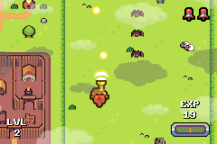

## Made with Butano: Varooom 3D

Action-packed with revolutionary 60FPS 3D technology and 3D glasses (not included) that will have you believing 
you're in the middle of a circuit race at speeds of 200 KMH!

The full source code and the creative commons assets of this game are in [its project folder](games/varooom-3d).

Get the latest Varooom 3D ROMs from [itch.io](https://gvaliente.itch.io/varooom-3d).

  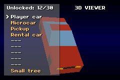

## Also made with Butano

* [GBA Microjam '23](https://gbadev.itch.io/gba-microjam-23): a spooky microgame collection for the Game Boy Advance
created by the members of the gbadev.net community.

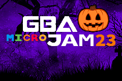 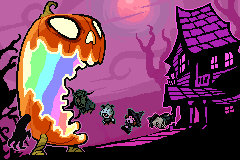

* [Feline](https://foopod.itch.io/feline): explore the world as a cat, meet new people, learn new languages, 
face difficult foes and save your family!

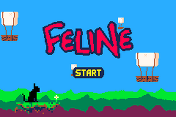 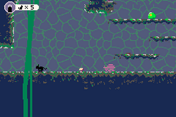

* [Symbol★Merged](https://copyrat90.itch.io/sym-merged): a puzzle platformer game where you can merge items 
(symbols) in hands, and use the superpower of the merged symbol.

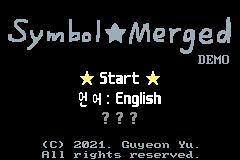 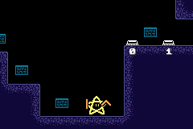

* [Green Memories](https://tengukaze.itch.io/green-memories-gba): the year is 300 a.f. and protagonist Cytra 
tries to survive the extreme climate of a post-apocalyptic desert while collecting data from her scientific research.

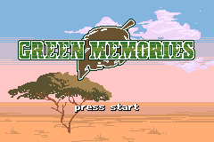 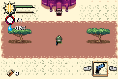

* [notenogram](https://kva64.itch.io/notenogram): chill analog-styled picross/nonogram/hanjie/griddler game,
with story and create modes.

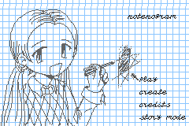 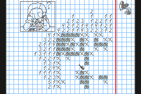

* [LRO - Luggage Retrieval Officer](https://foopod.itch.io/lro): you will work your way to being a highly ranked
member off staff, retrieving important missing luggage for the likes of the Natural History Museum, 
NASA and even the FBI!

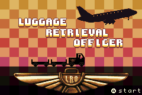 

* [Bridge Quest](https://fixxiefixx.itch.io/bridge-quest): find the way to the desert, but beware, 
because enemies and an evil tree boss will try to stop you!

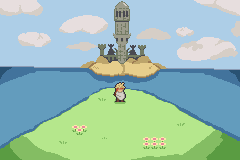 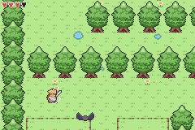

* [Advance! Adventures Of The Math & Logic Club](https://kva64.itch.io/advance-demo-adventures-of-the-math-logic-club): 
small demo/prototype of a visual novel about joining an ordinary math club.

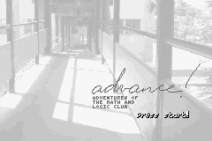 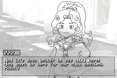

* [Knight Owls](https://blaise-rascal.itch.io/knight-owls): build up a powerful spellbook and take on many enemies, 
gather owls and upgrades while managing your health and money and defeat the final boss to win!

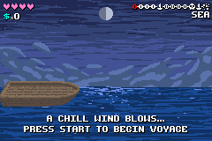 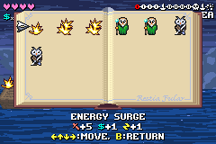

* [Collie Defense](https://xvayan.itch.io/collie-defense): you're a Border Collie and you need to protect 
your flock of sheep!

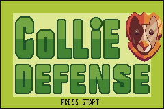 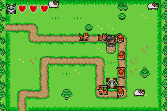

* [Sips](https://foopod.itch.io/sips): enjoy watching people while you earn money to upgrade your cafe.

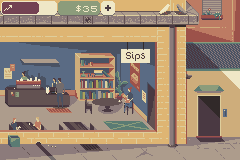

* [Nuclear Love](https://foopod.itch.io/nuclear-love): have fun getting to know other survivors in this dating-show, 
who knows, maybe you might find your future Mr. or Mrs Right?

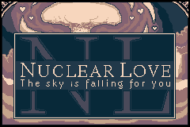 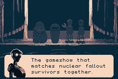

* [Tremblay Island](https://cinemint.itch.io/tremblay-island): take on the role of any island villager and 
interact with the others, taking part in the drama while eventually trying to keep a grouchy alligator 
from taking over the island.

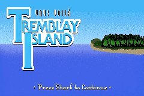 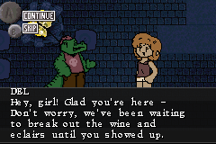

* [Frost Princess](https://squishyfrogs.itch.io/frost-princess): place tiles down on the board to create a path
to your opponent's base, then place tiles on their base to damage them.

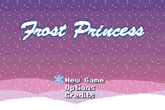 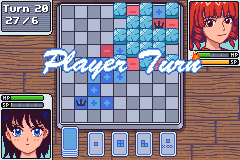

* [GBA-NICCC](https://github.com/GValiente/gba-niccc): Game Boy Advance port of the Atari ST demo STNICCC 2000.

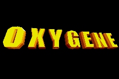 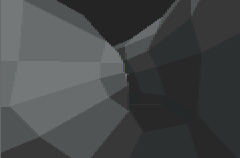

## More Butano related stuff

* [gba-free-fonts](https://github.com/laqieer/gba-free-fonts): free fonts for GBA development. 
It comes with tools and examples to import them into a Butano project.

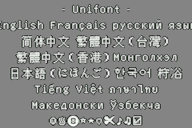 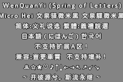
