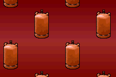
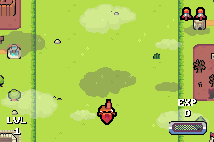

# Butano

Modern C++ high level GBA engine

## Features

* Create and display sprites, backgrounds, text, raster effects and more with only one line of C++ code.
* Custom standard library without heap allocations nor exceptions, based on [ETL](https://www.etlcpp.com/).
* Automatic assets build system.
* Multiple development tools like asserts, emulator logging and code profiling.
* Based on modern C++ concepts like shared ownership and RAII.
* Detailed documentation.
* Multiple examples explaining most aspects of the engine.
* The source code of a full game ([Butano Fighter](#butano-fighter)) is provided with this project.

## Supported platforms

Butano is built on top of the [devkitARM](https://devkitpro.org/) toolchain, so it supports Windows, 
macOS and Unix-like platforms.

## What's new

Curious about what was added or improved recently? Check out the changelog page in the documentation.

## Getting started

The best way to get started is to read the download, install and start using Butano guide in your project.

## Third party libraries

This project would have not been possible without these libraries:

* GBA hardware access and more provided by [Tonclib](https://www.coranac.com/projects/#tonc).
* Music and sound effects provided by [Maxmod](https://maxmod.devkitpro.org).
* Fast number to string conversion provided by [posprintf](http://danposluns.com/danposluns/gbadev/posprintf/index.html).
* Fast math routines provided by [gba-modern](https://github.com/JoaoBaptMG/gba-modern).

## Butano Fighter

This is Butano Fighter!

Stay alive while you shoot at everything that moves!

The full source code and the creative commons assets of this fun game come with Butano.

## Related projects

* [GBA-NICCC](https://github.com/GValiente/gba-niccc): Game Boy Advance port of the Atari ST demo STNICCC 2000.

## License

Butano is licensed under the zlib license, see the [LICENSE](LICENSE) file for details.
